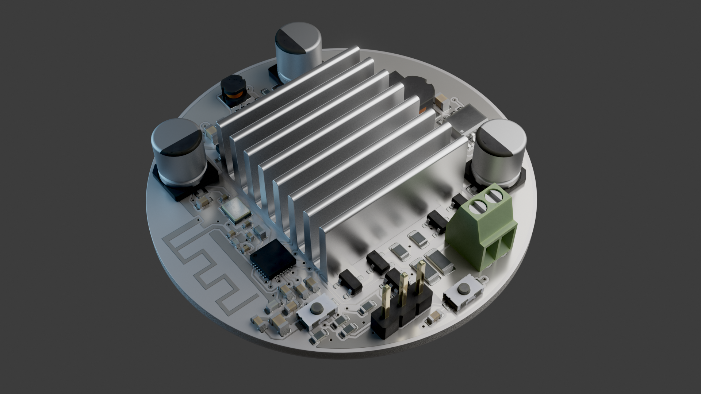
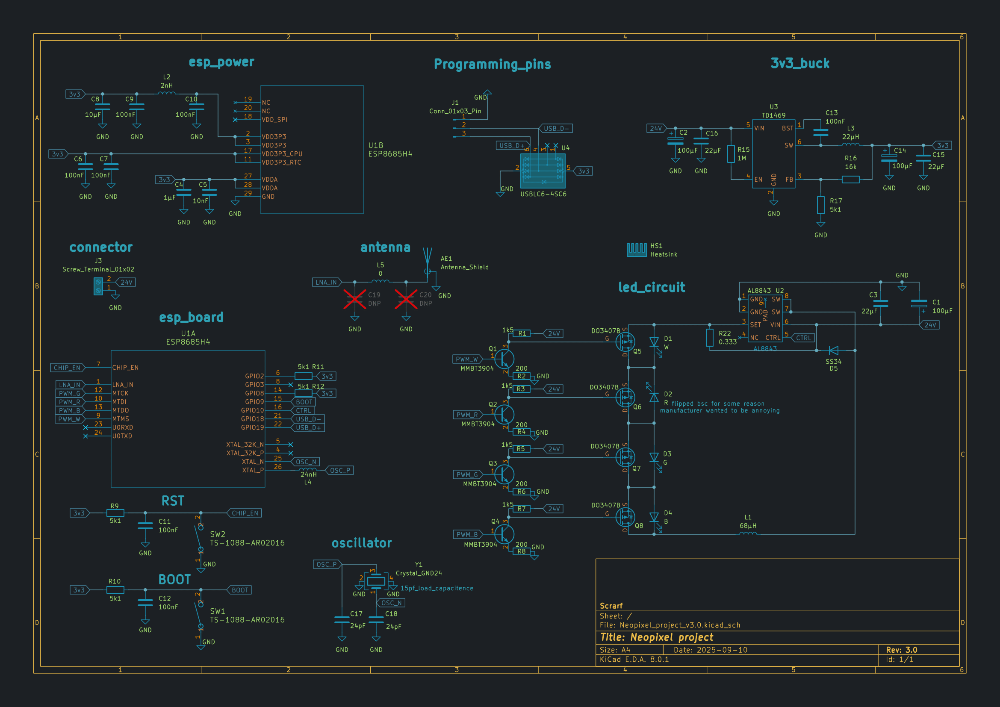
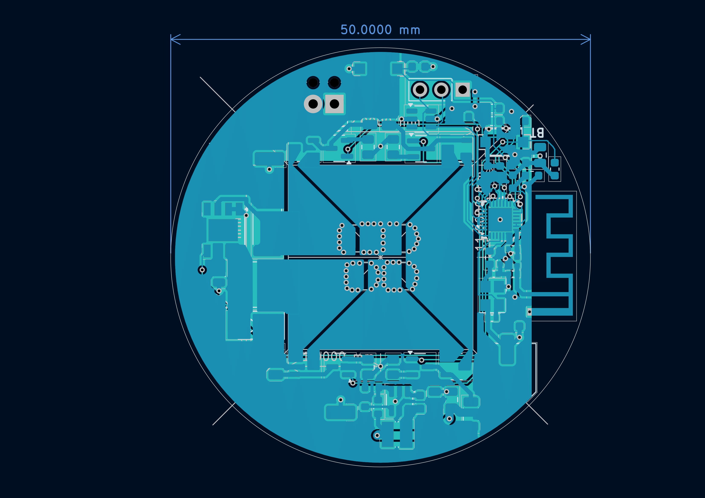

# (work in progress) Status: Hardware verification. 

# Introduction:
A dimmable RGBW LED controller that can be controlled with wifi or bluetooth. A constant current DC-DC buck converter provides stable current to all leds connected in series, up to 3A. Currently, it is programmed for 300mah by R22 current sensing resistor for the apropriate onboard 300mah LEDs.

# 3D render:

# Schematic:

# Layout:

