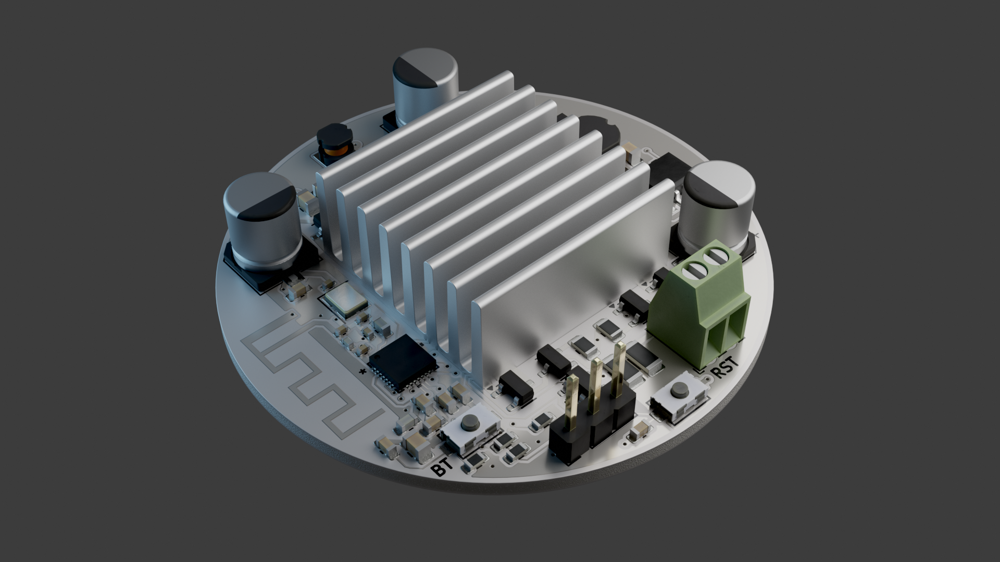

# (work in progress) Status: Hardware verification. 

# Introduction:
A dimmable RGBW LED controller that can be controlled with wifi or bluetooth. A constant current DC-DC buck converter provides stable current to all leds connected in series, up to 3A. Currently, it is programmed for 300mah by R22 current sensing resistor for the apropriate onboard 300mah LEDs.

# 3D render:

# Schematic:

# Layout:

# Bill of materials:

|Reference               |Value               |Datasheet                                                                                           |Footprint                                                                         |Qty|PPU   |DNP|
|------------------------|--------------------|----------------------------------------------------------------------------------------------------|----------------------------------------------------------------------------------|---|------|---|
|C1,C2,C14               |100µF               |https://www.lcsc.com/datasheet/C22383783.pdf                                                        |Capacitor_SMD:CP_Elec_6.3x7.7                                                     |3  |0.0193|   |
|C3,C15,C16              |22µF                |https://www.lcsc.com/datasheet/C22367832.pdf                                                        |Capacitor_SMD:C_0805_2012Metric                                                   |3  |0.1158|   |
|C4                      |1µF                 |https://www.lcsc.com/datasheet/C15849.pdf                                                           |Capacitor_SMD:C_0603_1608Metric                                                   |1  |0.0038|   |
|C5                      |10nF                |https://www.lcsc.com/datasheet/C60133.pdf                                                           |Capacitor_SMD:C_0402_1005Metric                                                   |1  |0.0009|   |
|C6,C7,C9,C10,C11,C12,C13|100nF               |https://www.lcsc.com/datasheet/C14663.pdf                                                           |Capacitor_SMD:C_0603_1608Metric                                                   |7  |0.0021|   |
|C8                      |10µF                |https://www.lcsc.com/datasheet/C33546007.pdf                                                        |Capacitor_SMD:C_0805_2012Metric                                                   |1  |0.0178|   |
|C17,C18                 |24pF                |https://www.lcsc.com/datasheet/C541435.pdf                                                          |Capacitor_SMD:C_0402_1005Metric                                                   |2  |0.0033|   |
|C19,C20                 |DNP                 |~                                                                                                   |Capacitor_SMD:C_0402_1005Metric                                                   |2  |0     |DNP|
|D1                      |W                   |https://www.lcsc.com/datasheet/C7500126.pdf                                                         |LED_SMD:LED_PLCC_2835                                                             |1  |0.069 |   |
|D2                      |R                   |https://www.lcsc.com/datasheet/C1322327.pdf                                                         |LED_SMD:LED_Luminus_MP-3030-1100_3.0x3.0mm                                        |1  |0.1638|   |
|D3                      |G                   |https://www.lcsc.com/datasheet/C1322328.pdf                                                         |LED_SMD:LED_Luminus_MP-3030-1100_3.0x3.0mm                                        |1  |0.1589|   |
|D4                      |B                   |https://www.lcsc.com/datasheet/C1322329.pdf                                                         |LED_SMD:LED_Luminus_MP-3030-1100_3.0x3.0mm                                        |1  |0.0962|   |
|D5                      |SS34                |https://www.lcsc.com/datasheet/C8678.pdf                                                            |Diode_SMD:D_SMA                                                                   |1  |0.0265|   |
|HS1                     |Heatsink            |https://www.lcsc.com/datasheet/C286191.pdf                                                          |22x22x10                                                                          |1  |0.1324|   |
|J1                      |Conn_01x03_Pin      |https://www.lcsc.com/datasheet/C5383112.pdf                                                         |Connector_PinHeader_2.54mm:PinHeader_1x03_P2.54mm_Vertical                        |1  |0.0105|   |
|J3                      |Screw_Terminal_01x02|https://www.lcsc.com/datasheet/C5188442.pdf                                                         |TerminalBlock_Phoenix:TerminalBlock_Phoenix_MPT-0,5-2-2.54_1x02_P2.54mm_Horizontal|1  |0.1513|   |
|L1                      |68µH                |https://www.lcsc.com/datasheet/C2929435.pdf                                                         |Inductor_SMD:L_Ferrocore_DLG-0504                                                 |1  |0.052 |   |
|L2                      |2nH                 |https://www.lcsc.com/datasheet/C395081.pdf                                                          |Inductor_SMD:L_0603_1608Metric                                                    |1  |0.0069|   |
|L3                      |22µH                |https://www.lcsc.com/datasheet/C41408473.pdf                                                        |Inductor_SMD:L_Ferrocore_DLG-0302                                                 |1  |0.0184|   |
|L4                      |24nH                |https://www.lcsc.com/datasheet/C139271.pdf                                                          |Inductor_SMD:L_0603_1608Metric                                                    |1  |0.0064|   |
|L5                      |0                   |https://www.lcsc.com/datasheet/C106231.pdf                                                          |Inductor_SMD:L_0402_1005Metric                                                    |1  |0.0006|   |
|Q1,Q2,Q3,Q4             |MMBT3904            |https://www.lcsc.com/datasheet/C2762221.pdf                                                         |Package_TO_SOT_SMD:SOT-23                                                         |4  |0.0095|   |
|Q5,Q6,Q7,Q8             |DO3407B             |https://www.lcsc.com/datasheet/C41367402.pdf                                                        |Package_TO_SOT_SMD:SOT-23-3                                                       |4  |0.0271|   |
|R1,R3,R5,R7             |1k5                 |https://www.lcsc.com/datasheet/C2980089.pdf                                                         |Resistor_SMD:R_1206_3216Metric                                                    |4  |0.013 |   |
|R2,R4,R6,R8             |200                 |https://www.lcsc.com/datasheet/C3014166.pdf                                                         |Resistor_SMD:R_0805_2012Metric                                                    |4  |0.0156|   |
|R9,R10,R11,R12,R17      |5k1                 |https://www.lcsc.com/datasheet/C103696.pdf                                                          |Resistor_SMD:R_0603_1608Metric                                                    |5  |0.0009|   |
|R15                     |1M                  |https://www.lcsc.com/datasheet/C103216.pdf                                                          |Resistor_SMD:R_0603_1608Metric                                                    |1  |0.001 |   |
|R16                     |16k                 |https://www.lcsc.com/datasheet/C137788.pdf                                                          |Resistor_SMD:R_0603_1608Metric                                                    |1  |0.0012|   |
|R22                     |0.333               |https://www.lcsc.com/datasheet/C160932.pdf                                                          |Resistor_SMD:R_2512_6332Metric                                                    |1  |0.0488|   |
|SW1,SW2                 |TS-1088-AR02016     |https://www.lcsc.com/datasheet/C720477.pdf                                                          |TS-1088-AR02016:SW_TS-1088_XNP                                                    |2  |0.0415|   |
|U1                      |ESP8685H4           |https://www.lcsc.com/datasheet/C4944062.pdf                                                         |ESP8685:QFN284X4_EXP                                                              |1  |1.3435|   |
|U2                      |AL8843              |https://www.lcsc.com/datasheet/lcsc_datasheet_2412251103_Diodes-Incorporated-AL8843SP-13_C507866.pdf|Package_SO:Diodes_SO-8EP                                                          |1  |0.3568|   |
|U3                      |TD1469              |https://www.lcsc.com/datasheet/C2832208.pdf                                                         |Package_TO_SOT_SMD:TSOT-23-6                                                      |1  |0.2999|   |
|U4                      |USBLC6-4SC6         |https://www.lcsc.com/datasheet/C19170931.pdf                                                        |Package_TO_SOT_SMD:SOT-23-6                                                       |1  |0.0273|   |
|Y1                      |Crystal_GND24       |https://www.lcsc.com/datasheet/C501793.pdf                                                          |Crystal:Crystal_SMD_Abracon_ABM8AIG-4Pin_3.2x2.5mm                                |1  |0.0922|   |
